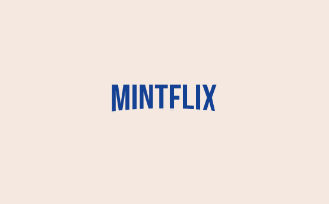

# **MINTFLIX**

## The Idea
In october 2021 [MINTvernetzt](https://mint-vernetzt.net/) arranged a one-week hackathon in which the participants could present a feature they thought should be included in the final application.

We decided on a content management platform to share blogs, videos and projects amongst to future users and what better name to give a CMS in the MINT domain than **MINTFLIX**.

## The implementation
In order to present our idea we wanted to code the rough prototype of the platform ourselves. We used [Blitz.js](https://blitzjs.com/) and the [Tailwind](https://tailwindcss.com/) css library to be able to quickly get a prototype working.

The app consists of a user management as well as three models namely articles, videos and projects, where projects are basically the combination of multiple videos and articles.

All the content is displayed on a NETFLIX inspired dashboard to allow for an intuitive usage of the platform. With  the colors we kept to the MINTvernetzt color palette.

## Final thoughts
It's not over yet, so we can't give any conclusion!

&#35;MINT &#35;MINTathon &#35;CMS &#35;MINTFLIX

